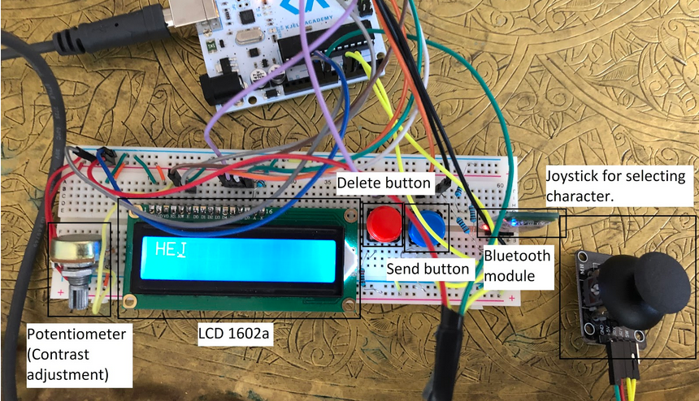

### Arduino Chat
A message station that can receive and transfer text to a smartphone via bluetooth.
The user of the message station can write a message with a joystick and receive messages on a display.
The user of the smartphone can see what the other user has written and respond with their own messages.

### How it works
Bluetooth module (HC-06) is used for sending and receiving data.
LCD 1602a (16 characters and 2 rows) is used for displaying messages.
A potentiometer can adjust the resistance in the circuit, this is used to change the contrast of the display.
With the joystick, left and right is used to navigate between characters and up and down to change the selected character.
A terminal on the smartphone is used to receive and send data through a serial bluetooth connection.

